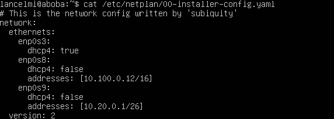
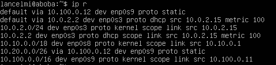

# Сети в Linux

Настройка сетей в Linux на виртуальных машинах.

## Часть 1. Инструмент ipcalc

### Часть 1.1 Инструмент ipcalc

- Адрес сети *192.167.38.54/13* \
   
- Перевод маски *11111111.11111111.11111111.11110000* - */28*, обычная *255.255.255.240*

### Часть 1.2 localhost

- Адреса *194.34.23.100*, *128.0.0.1* - не localhost, а *127.0.0.2*, *127.1.0.1* - localhost

### Часть 1.3 Диапазоны и сегменты сетей

- Адреса *10.0.0.45*, *192.168.4.2*, *172.20.250.4*, *172.16.255.255*, *10.10.10.10* - частные, а
*134.43.0.2*, *172.20.250.4*, *172.20.250.4*, *172.0.2.1*, *192.169.168.1* - публичные. \
   

- Подходит всё что между HostMin и HostMax \
  

- *10.10.0.2*, *10.10.10.10*, *10.10.1.255* - подходят, а *10.0.0.1* и *10.10.100.1* не подходят

## Часть 2. Статическая маршрутизация между двумя машинами

- Текущий интерфейс у машины ws1 \
  

- Текущий интерфейс у машины ws2 \
  

- Новый сетевой интерфейс для машины ws1 \
  

- Новый сетевой интерфейс для машины ws2 \
  

- Добавление статического маршрута вручную и пинги ws1 \
  

- Добавление статического маршрута вручную и пинги ws2 \
  

- Конфиг для добавления статического машрута вручную и пинги ws1\
   \
  

- Конфиг для добавления статического машрута вручную и пинги ws2 \
   \
  

## Часть 3. Утилита **iperf3**

- Запуск программы iperf3 на ws1 \
  

- Подключение с ws2 на w1 и замер скорости. \
  8 Mbps = 1 MB/s. 100 MB/s = 800000 Kbps. 1 Gbps = 1000 Mbps. \
  

## Часть 4. Сетевой экран

- Фаерволл ws1 \
  
- Фаерволл ws2 \
  
- Запуск файервола ws1 \
  
- Запуск файервола ws2 \
  

  Разница подходов в том, что применяется первое правило, значит ws1 нельзя пингануть, а ws2 можно.

- Пингуем ws1 с ws2 \
  

- Пингуем ws2 с ws1 \
  

  Видим что ws1 не пингуется, как и было написано выше.

- Показываем командой nmap что хост ws1 запущен \
  

## Часть 5. Статическая маршрутизация сети

Создаем 5 виртуальных машин (я использовал клонирование для удобства)

#### 5.1. Настройка адресов машин

- Конфиг ws11 \
  

- Конфиг ws21 \
  

- Конфиг ws22 \
  

- Конфиг r1 \
  

- Конфиг r2 \
  

- Вызов ip -4 a для ws11 \
  

- Вызов ip -4 a для ws21 \
  

- Вызов ip -4 a для ws22 \
  

- Вызов ip -4 a для r1 \
  

- Вызов ip -4 a для r2 \
  

#### 5.2. Включение переадресации IP-адресов.

- Включение временной переадресации на r1 \
  

- Включение временной переадресации на r2 \
  

- Включение постоянной переадресации на r1 \
  

- Включение постоянной переадресации на r2 \
  

#### 5.3. Установка маршрута по-умолчанию

- Шлюз по умолчанию для ws11 \
  

- Шлюз по умолчанию для ws21 \
  

- Шлюз по умолчанию для ws22 \
  

- Доказательство что шлюз добавился для ws11 \
  

- Докатательство что шлюз добавился для ws21 \
  

- Докатательство что шлюз добавился для ws22 \
  

- Пинг r2 c ws11 \
  

- tcpdump с r2\
  

#### 5.4. Добавление статических маршрутов

- Добавление статического маршрута r1 \
  

- Добавление статического маршрута r2 \
  

- Доказательство что маршрут добавился для r1 \
  

- Доказательство что маршрут добавился для r2 \
  

- Сравнение машрутов для двух сетей ws11. Маршруты разные потому что приоритет имеет таблица маршрутизации, а потом используется маршрут по умолчанию \
  

#### 5.5. Построение списка маршрутизаторов

- Вызов команды `traceroute 10.20.0.10` \
  

- Вывод команды `tcpdump -tnv -i enp0s8` на r1 \
  

Команда сначала посылает один пакет с ttl 1, затем ttl 2 и т.д. пока не достигнет целевого узла. Каждый раз когда пакет проходит через маршрутизатор ttl уменьшается на один. В конце концов пакет доходит до искомого и  выводится время между отправкой и ответом пакета. Предыдщие же пакеты не доходят и показывают айпи маршрутизаторов (они посылают ответ и говорят что отправить пакет нельзя)

#### 5.6. Использование протокола **ICMP** при маршрутизации

- Вывод команды `tcpdump -n -i enp0s8 icmp` на r1 \
  

- Пингуем с ws11 несуществующий IP \
  

## Часть 6. Динамическая настройка IP с помощью **DHCP**

- DHCP для r2 \
  

- Прописываем DNS сервер для r2 \
  

- Перезапуск службы DHCP r2 \
  

- Показываем что ws21 получила адрес \
  

- Пингуем ws22 с ws21 \
  

- Даём MAC адресс ws11 \
  

- Аналогичная настройка r1 только с привязкой по MAC \
   \
   \
  

- Показываем что ws11 получила адрес \
  

- Запрашиваем обновление для ws21. Использовалось просто `sudo dhcclient` \
  
- Адрес до обновления \
  

## Часть 7. **NAT**

- Делаем Апач общедоступным на ws22 и r1 \
   \
  

- Запускаем апач на ws22 и r1 \
   \
  

- Создаём фаервол на r2 и запускаем \
   \
  

- Пингуем ws22 c r1 \
  

- Разрешаем маршрутизацию ICMP пакетов и запускаем \
   \
  

- Пингуем ws22 с r1 \
  

- Включаем DNAT и SNAT на r2 и запускаем \
  

- Подключаемся с ws22 на r1 \
  

- Подключаемся с r1 на ws22 \
  

## Часть 8. Знакомство с **SSH Tunnels**

- Фаервол на r2 \
  

- Запуск Апач на локалхост ws22 \
  

- Запускаем Local TCP forwarding и подключаемся \
   \
  

- Запускаем Remote TCP forwarding и подключаемся \
   \
  